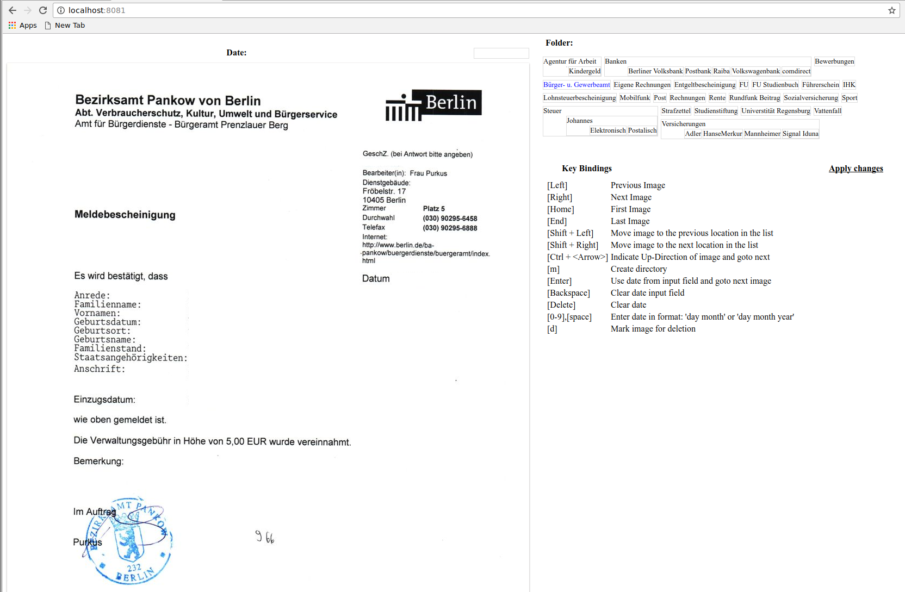

# memis: efficient manual image sorting [](https://travis-ci.org/johannesgerer/memis)

*memis* is a little tool written in Haskell. It allows to efficiently
rename and sort image files into directories, via an intelligent  web-interface.

Supported operations:

* moving into a folder
* creating new subfolders
* deletion
* rotation
* entering dates
* specifying the order of documents with equal dates

## Alternatives

This software tries to be better than its alternatives:

* [Photosift](http://www.rlvision.com/photosift/about.asp)
* [Manual Imagesort](https://sourceforge.net/projects/manualimagesort/)
* [ImgSorter](https://sourceforge.net/projects/imgsorter/?source=directory)
* [XnViewMP](http://www.xnview.com/en/xnviewmp/)
* [Zoner Photo Studio Free](https://free.zoner.com/)

Do you now another program that should be on this list?

## Installation

```shell
stack install
```

## Usage

First start the server

```shell
memis [source folder with images] [target folder]
```

and then navigate to [`http://localhost:8081`](http://localhost:8081).

## Screenshot


